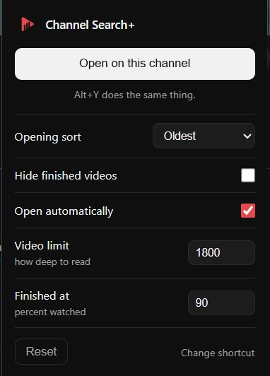

# Channel Search+ for YouTube

YouTube's in-channel search only matches words in titles. You cannot ask it for
videos under twenty minutes, or the ones you started and never finished, or a
big channel's best work. This adds all of that, by reading the channel's entire
upload history first and then letting you query it.

Free, with no paid tier. It runs entirely in your browser: no account, no API
key, no server, nothing sent anywhere.

## The idea

Most in-page filter tools only touch the video cards already loaded on screen,
so they can sort what you have scrolled past and nothing more. This one pulls
the channel's complete catalogue through YouTube's internal InnerTube API before
it filters anything, so every sort, statistic, and chart covers all of it.
Questions like "what are this channel's least-viewed videos" or "what is the
median length across 1,200 uploads" are unanswerable from the loaded DOM, and
trivial here.

## Search

The main view. It replaces the native grid in place, with a Restore YouTube
button to put things back.

Filter by title keyword, length band, view band, upload recency, and **watch
state**. That last one is the piece plain YouTube never gives you: hide
everything you have already finished, or pull up only the videos you started and
abandoned. Your progress rides along in the same payload the catalogue comes
from, so finding the unwatched half of a 900-video back catalogue takes one
dropdown.

Two more are built for the moment you actually want to watch something. **Start
here** is for landing on a huge channel cold: sorting by raw views just hands
you the oldest uploads, so it scores by views per day and caps how many come
from any one year, giving you the channel's best work spread across its life.
**Free time** takes the minutes you have and shows only what will fit. Set it to
20, set Watched to not started, and you have the answer to what should I watch
right now.

Sort by views, length, views per day, measured trend, or hidden gems, meaning
fast relative to the channel but still small in absolute terms. A summary line
recalculates as you filter.

## Insights

Everything analytical, behind one tab, in four sections.

**Overview.** Charts drawn from whatever the filters currently select: uploads
per year, median views by upload year, view and length distributions, and the
median views for each video length, which shows where a channel's sweet spot
is. Click any distribution bar to filter the grid by it. Underneath sits a
title-format table: which framings this channel's audience has responded to,
across questions, versus, numbered lists, how-to and superlatives. That last
one is the part YouTube Studio does not do even for your own channel, because
Studio tells you what performed and never which pattern performed.

**Compare.** Read any other channel's full catalogue and set its median views,
median views per day, length, and top performers against this one.

**Watchlist.** Track a set of channels. Refresh reads all of them and gives you
two things: what is working right now, and content gaps, the topics they rank
for that this channel never has. Once a tracked channel has been refreshed
twice, "what is working" ranks by measured velocity, how fast each video is
moving relative to how fast that channel normally moves, so a small channel's
breakout can outrank a big channel's average upload. Until then it falls back to
the lifetime average.

Alongside that: catalogues cache locally so re-opening is instant, refreshing
flags uploads added since your last visit, and any filtered set exports to CSV
or JSON.

## What it will not tell you

Several things that a catalogue like this can be made to say were taken out,
because they read as findings without being able to support the weight.

There is no per-word lift table. Ranking every word in a catalogue by the
median views of the videos containing it surfaces whichever words happened to
land on hits, and no sample-size floor fixes that, because the problem is not
the sample. A word does not cause views, its subject does, and there is no
move on the other end: you cannot put "zombies" in a title about phones.
Title-format analysis survived the same question, since eight categories fixed
in advance are eight hypotheses rather than a search through the corpus, and
"try a question" is a change someone can actually make.

There is no rising-or-fading verdict on a channel. Views are cumulative, so a
video from 2020 has had six years to collect them and one from 2025 has had
one. A channel performing identically every year still slopes downward on that
chart. Views per day only inverts the bias, because a recent upload sits inside
its launch spike. The honest metric is views in the first thirty days by year,
and that needs per-video history nobody has retroactively. The chart stays,
because where a channel's strongest years sit is worth seeing. The verdict on
top of it does not, and the bias is named on the card so it can be discounted.

Cards carry no outlier badge. It divided a recent upload's launch spike by a
lifetime average made mostly of old videos, so a badge reading "376x" was
largely reporting that the video was new. Sorting by views per day ranks the
same videos without printing a figure that cannot be defended.

Nor is there a title-length chart, which had no mechanism behind it in the
first place.

## Measured velocity

Every refresh stores a snapshot of every video's view count with a timestamp.
Diff two snapshots and you get something the relative dates cannot give you:
real, measured growth. "Gained 380K views in the last 4 days" is observed, not
inferred. The tool gets more useful the more often you open it, and the history
is yours alone, kept locally.

Listing view counts carry two significant figures, so a video showing 2.4M moves
in steps of 100,000. Growth below one step is invisible, and a single step
across a boundary is indistinguishable from 100,000 real views. Anything that
could be explained by that rounding is discarded rather than recorded, which
costs visibility into ordinary movement on large videos and buys the guarantee
that a reported jump is a real one.

## How it works

The in-channel search box is a server-side InnerTube request that only matches
text, so every metric has to be computed client-side. The extension:

1. Reads the channel's `/videos` HTML and pulls `ytInitialData` along with the
   InnerTube key and client version.
2. Walks the uploads grid with continuation tokens against `/youtubei/v1/browse`,
   reading each video's id, title, duration, view count, and relative date. All
   of that already lives in the list payload, so there is no per-video request.
3. Filters, analyses, and renders everything locally.

Every request is same-origin from the YouTube tab, so it rides your normal
session and needs no API key of your own.

## Install

Once it is on the stores, install links go here. Until then, from source:

Run `node build.js` first. It has no dependencies and writes `dist/chrome` and
`dist/firefox`, which differ only in the manifest, plus a zip of each for store
submission.

**Chrome or Edge.** Open `chrome://extensions` (or `edge://extensions`), turn on
Developer mode, choose Load unpacked, and select `dist/chrome`.

**Firefox.** Open `about:debugging`, choose This Firefox, then Load Temporary
Add-on, and pick the `manifest.json` inside `dist/firefox`.

Then open any channel's Videos tab, for example `youtube.com/@mkbhd/videos`, and
click the Search+ button at the bottom right, or press Alt+Y.

Clicking the toolbar icon opens the panel on the channel you are looking at and
holds the settings: how deep to read a channel, what counts as finished, which
sort to open on, and whether to hide watched videos or open automatically.
Changes save as you make them. The shortcut can be rebound at
`chrome://extensions/shortcuts`.

## Layout

The panel is plain JavaScript with no build step and no dependencies. Chrome
loads content scripts in order into a single shared scope, so the modules below
are ordinary scripts rather than ES modules, and the order in the manifest is
load-bearing.

| File | Holds |
| --- | --- |
| `src/core.js` | Settings, parsers, and the InnerTube catalogue reader. No DOM. |
| `src/grid.js` | Runtime state, the filter and sort pipeline, the video grid. |
| `src/store.js` | IndexedDB cache, view-count snapshots, stats, export. |
| `src/charts.js` | SVG charts and the Overview section. |
| `src/analysis.js` | Channel comparison and title-format analysis. |
| `src/niche.js` | Watchlist, cross-channel outliers, view switching. |
| `src/panel.js` | Panel construction, grid takeover, startup. |

`background.js` exists only to relay the keyboard shortcut into the page, and
`popup.*` is the toolbar popup. `docs/design-preview.html` renders the real
panel against generated data, so the design can be checked without hunting for
a channel with the right shape of history.

`server/` is **not part of the extension** and never ships. `build.js` copies
only the paths in its `SHARED` list, and that directory is not among them, so
nothing in it reaches `dist/` or either store package. It holds a local Node
experiment into whether a scheduled poller could measure what the extension
structurally cannot, since the extension only observes while a tab is open. Its
findings fed back into the shipped rounding floor. See
[server/README.md](server/README.md).

One permission note worth knowing before anyone trims the manifest. The
extension asks for `host_permissions` on `www.youtube.com`, which looks
redundant given every fetch is same-origin from a YouTube page. It is not.
`chrome.tabs.query` leaves `url` undefined unless the extension holds either
the `tabs` permission or a host permission matching that tab, and both
`background.js` and `popup.js` read `tab.url` to tell whether the active tab is
a channel. Dropping the host permission would silently break the keyboard
shortcut and the popup, with no error to explain it. The `tabs` permission
would also work and is broader, showing a browsing-history warning at install,
so the narrower of the two is the one requested.

## Notes and limits

- Public view counts are all anyone gets for a channel they do not own, so this
  is a signal tool rather than a precision instrument. For other people's
  channels every tool is working from the same public numbers.
- Upload dates from InnerTube are relative ("6 months ago"), so views per day
  and the per-year charts are approximate. Measured velocity is not, because it
  comes from your own snapshots.
- Velocity needs at least two visits before it can show anything.
- Watch state comes from your signed-in session, so it is empty when signed out
  and it ages with the cache. Refresh to bring it up to date. A video counts as
  finished at 90 percent, which is roughly where YouTube stops offering a
  resume.
- Shorts carry no duration or upload date in their payload, so anything that
  depends on age or length is blank for them and they stay out of the main
  catalogue rather than moving every median in the product.
- The catalogue fetch is capped at 1,800 videos by default, adjustable in
  options. Refreshing a watchlist reads each channel in turn, so a large one
  takes a while.
- InnerTube is an unofficial endpoint. It is stable in practice, but YouTube can
  change the payload shape, which would call for a small parser update.

## Roadmap

- Sparklines per video once a few snapshots have accumulated.
- Exact stats and likes through the official Data API, opt-in with your own key.

## Privacy

Nothing is collected, transmitted, or sold. Catalogues, snapshots and watchlists
stay in your browser. See [PRIVACY.md](PRIVACY.md).

## License

PolyForm Noncommercial 1.0.0. See [LICENSE](LICENSE).

Source-available rather than open source. Read it, learn from it, run it, modify
it for yourself. The one restriction is that you may not sell it or ship it
inside something you sell.
